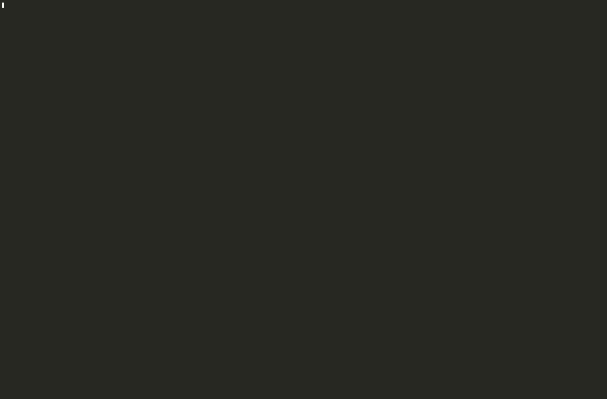

<p align="center">
  
</p>

<h1 align="center">y2kexplorer</h1>

<p align="center">
  <em>kafka, but make it ps2</em><br>
  <sub>explore your kafka universe ✦ retro-Kafka TUI на Rust + ratatui</sub>
</p>

<p align="center">
  <a href="README.md">English version</a>
</p>

y2kexplorer — клавиатурный TUI для исследования и повседневной работы с кластером Apache Kafka.
По духу это альтернатива [k9s](https://github.com/derailed/k9s), [AKHQ](https://akhq.io/) или [Redpanda Console](https://www.redpanda.com/redpanda-console-kafka-ui) — но на Rust + [ratatui](https://docs.rs/ratatui) с аккуратной multi-panel вёрсткой в духе [eilmeldung](https://github.com/christo-auer/eilmeldung).

Возможности:

- **Topics** — список с фильтром, метаданные партиций, опциональный подсчёт сообщений.
- **Messages** — head / tail, выбор партиции, сортировка по времени, live-follow, pretty-print JSON.
- **Produce** и **создание / удаление топиков**.
- **Consumer groups** — список, lag, reset offsets, удаление пустых групп.
- **Schema Registry** — subjects, версии, просмотр Avro/JSON-схем.
- **Kafka Connect** — коннекторы, статус, pause / resume / restart / delete.
- **ACL**, локальные **лейблы топиков**, переключение **нескольких кластеров** в TUI.
- **Аутентификация** — PLAINTEXT, SASL/PLAIN, SCRAM, SSL, Kerberos (GSSAPI) через keytab.
- Четыре **темы UI** под тёмный или светлый терминал — переключение в TUI клавишей `T`.

<p align="center">
  
</p>

## Ограничения

- Инструмент для повседневного исследования и лёгких операций — не полная замена админки кластера.
- Avro-схемы читаются из Schema Registry по HTTP; встроенного SR-клиента сверх browse нет.
- Большие списки топиков могут грузиться долго при включённом подсчёте сообщений (см. [конфигурацию](docs/ru/configuration.md#производительность-списка-топиков)).
- Готовые Linux-бинарники рассчитаны на glibc 2.35+ (Ubuntu 22.04+); на более старых дистрибутивах — сборка из исходников.

## Быстрый старт

```bash
mkdir -p ~/.config/y2kexplorer
cp config.example.toml ~/.config/y2kexplorer/config.toml
$EDITOR ~/.config/y2kexplorer/config.toml

y2k                            # дефолтный кластер из конфига
y2k --cluster <name>           # именованный кластер
y2k-probe --cluster <name>     # smoke-тест подключения без TUI
```

Готовые бинарники для **macOS arm64** и **Linux x86_64** — на странице [Releases](https://github.com/armitageee/y2kexplorer/releases).
Сборка из исходников: `cargo build --release --bin y2k --bin y2k-probe --all-features`.

Подробности: [Установка](docs/ru/installation.md).

## Попробовать локально

> [!NOTE]
> Для встроенного KRaft-стека нужен Docker (SASL/PLAIN, ACL, Schema Registry, демо Kafka Connect).

```bash
git clone https://github.com/armitageee/y2kexplorer.git
cd y2kexplorer
cp config.example.toml ~/.config/y2kexplorer/config.toml

just up      # или: docker compose up -d
just dev     # или: cargo run --release -- --cluster local
```

Подробности: [Локальный Docker-стек](docs/ru/docker.md).

## Документация

| Раздел | Файл |
|---|---|
| Установка | [docs/ru/installation.md](docs/ru/installation.md) |
| Конфигурация и аутентификация | [docs/ru/configuration.md](docs/ru/configuration.md) |
| Темы интерфейса | [docs/ru/themes.md](docs/ru/themes.md) |
| Горячие клавиши | [docs/ru/keybindings.md](docs/ru/keybindings.md) |
| Локальный Docker-стек | [docs/ru/docker.md](docs/ru/docker.md) |
| Разработка | [docs/ru/development.md](docs/ru/development.md) |

Оглавление: [docs/README.ru.md](docs/README.ru.md) · [docs/README.md](docs/README.md) (English).

## Лицензия

MIT
